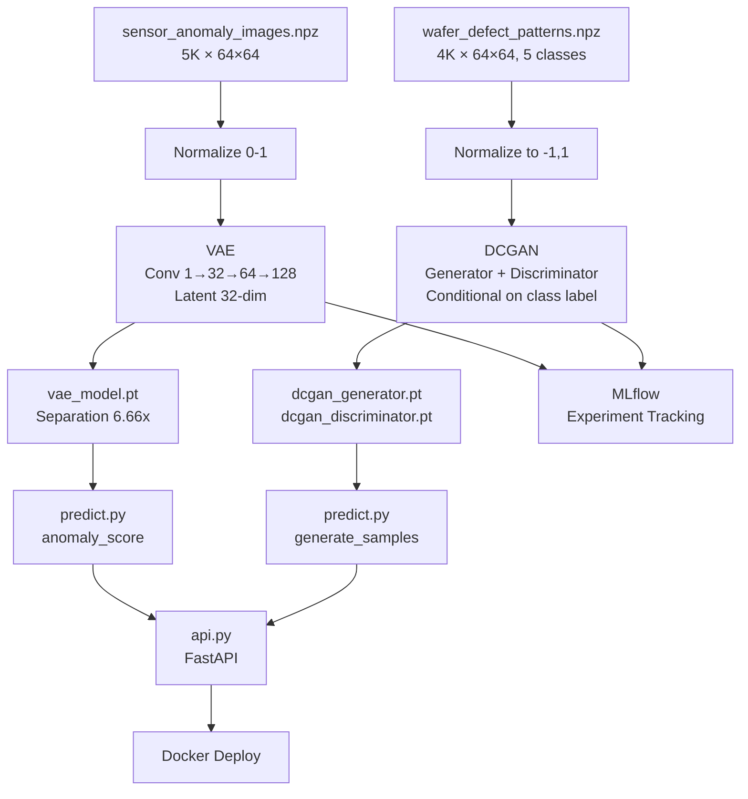

# Autoencoders & GANs

Building Variational Autoencoders for anomaly detection and Conditional DCGANs for synthetic data generation — from first principles. Two semiconductor inspection datasets: sensor anomaly images (5K, unsupervised anomaly detection) and wafer defect patterns (4K, 5-class conditional generation). MLflow experiment tracking throughout.

---

## Results

| Dataset | Model | Architecture | Metric | Score |
|---------|-------|-------------|--------|-------|
| Sensor Anomaly | VAE | Conv 1→32→64→128, Latent 32 | Normal recon error | **0.0010** |
| Sensor Anomaly | VAE | Conv 1→32→64→128, Latent 32 | Anomaly recon error | **0.0067** |
| Sensor Anomaly | VAE | Conv 1→32→64→128, Latent 32 | Separation ratio | **6.66x** |
| Wafer Defect | DCGAN | Gen 256→128→64→32→1, Disc 2→64→128→256→512 | Final D_loss | **0.174** |
| Wafer Defect | DCGAN | Gen 256→128→64→32→1, Disc 2→64→128→256→512 | Final G_loss | **2.810** |

## Datasets

| Dataset | Samples | Resolution | Classes | Task |
|---------|---------|-----------|---------|------|
| sensor_anomaly_images.npz | 5,000 (4K normal + 1K anomaly) | 64×64 grayscale | 2 | Unsupervised anomaly detection |
| wafer_defect_patterns.npz | 4,000 (800 per class) | 64×64 grayscale | 5 (none, center, edge_ring, scratch, random) | Conditional generation |

## Advanced Concepts

| Concept | Implementation | Key Insight |
|---------|---------------|-------------|
| Vanilla Autoencoder | Encoder-decoder with bottleneck in pure NumPy | Dimensionality reduction via learned compression |
| Variational Autoencoder | Reparameterization trick + ELBO loss | Structured latent space enables controlled generation |
| DCGAN | Strided convolutions, BatchNorm, LeakyReLU | Stable GAN training via architectural conventions |
| Conditional GAN | Label embeddings concatenated to noise and images | Generate specific defect types on demand |
| Latent Space Interpolation | Linear interpolation between z vectors | Smooth transitions reveal learned representations |
| Anomaly Detection | VAE reconstruction error as anomaly score | Unsupervised fault detection with zero anomaly labels |
| MLflow Tracking | Per-epoch loss, separation ratio, artifact logging | Experiment comparison and model provenance |

## Repository Structure

```
014_autoencoders_and_gans/
├── .gitignore
├── README.md
├── requirements.txt
├── assets/
│   ├── proj1_sensor_anomaly_detection.png    # Normal vs anomaly reconstruction error
│   ├── proj1_sensor_flowchart.png            # VAE pipeline flowchart
│   ├── proj1_sensor_latent_interpolation.gif # Latent space interpolation animation
│   ├── proj1_sensor_latent_space.png         # 2D latent space visualization
│   ├── proj1_sensor_samples.png              # Normal and anomaly sample images
│   ├── proj1_sensor_vae_training.png         # VAE training loss curve
│   ├── proj1_sensor_vanilla_ae_recon.png     # Vanilla AE reconstructions
│   ├── proj2_wafer_flowchart.png             # DCGAN pipeline flowchart
│   └── proj2_wafer_samples.png               # Wafer defect pattern gallery
├── data/
│   ├── sensor_anomaly_images.npz             # 5K sensor images (normal + anomaly)
│   └── wafer_defect_patterns.npz             # 4K wafer maps (5 defect classes)
├── deploy/
│   ├── Dockerfile
│   └── docker-compose.yml
├── docs/
│   ├── Autoencoders_and_GANs_Report.html
│   └── Autoencoders_and_GANs_Report.pdf
├── models/
│   ├── vae_model.pt                          # Trained VAE (4.0 MB)
│   ├── dcgan_generator.pt                    # Trained DCGAN generator (3.7 MB)
│   └── dcgan_discriminator.pt                # Trained DCGAN discriminator (11 MB)
├── notebooks/
│   ├── 01_sensor_anomaly_vae.ipynb           # VAE from scratch + anomaly detection
│   └── 02_wafer_defect_gan.ipynb             # Conditional DCGAN + generation
├── src/
│   ├── train.py                              # Trains VAE + DCGAN with MLflow
│   ├── predict.py                            # Anomaly scores + sample generation
│   └── api.py                                # FastAPI /predict + /generate endpoints
└── tests/
    └── test_model.py                         # Model existence + inference tests
```

## Tech Stack

| Tool | Version | Purpose |
|------|---------|---------|
| Python | 3.12 | Core language |
| PyTorch | 2.0+ | VAE, DCGAN training and inference |
| NumPy | 1.24+ | Data loading, array operations |
| scikit-learn | 1.3+ | Metrics |
| Matplotlib / seaborn | 3.7+ / 0.12+ | Visualization |
| MLflow | 2.5+ | Experiment tracking |
| FastAPI | 0.100+ | REST API serving |
| Docker | 24+ | Containerized deployment |

## Getting Started

```bash
pip install -r requirements.txt

# Train VAE + DCGAN (with MLflow tracking)
python src/train.py

# Run predictions (anomaly scores + sample generation)
python src/predict.py

# Run tests
python tests/test_model.py

# Start API server
uvicorn src.api:app --reload
```

## Architecture


